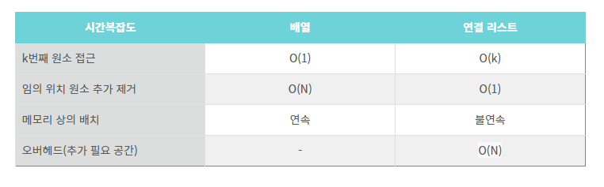

**바킹톡 알고리즘 문제풀이**
- 11/15일 배열문제(알파벳 개수)
- 11/16 연결리스트

**알고리즘 내용 정리**
- 선형 자료구조인 배열과 연결리스트의 차이를 알아두는것이 좋다
- **배열**
  - 데이터의 개수가 정해져 있는경우,데이터의 수정이 적은경우,데이터의 검색이 빈번한 경우에 유리한 자료구조이다.
  - 특징으로는 연속된 메모리공간에 순차적으로  저장된다는 것이다.
  - 장점은 인덱스를 가지기 때문에 데이터에 바로접근이 가능하다는것이다
  - 단점은 삽입과 삭제시 데이터를 이동시켜 인덱스를 유지해야하고,크기가 가변이아니라는것이다.
- **연결리스트**
  - 리스트와 배열의 가장큰 차이는 인덱스의 유무이다.
  - 리스트는 인덱스를 포기하고 노드를 연결해 데이터를 적재하는 선형구조이다.
  - 불연속적인 메모리 공간을 가지며 삽입과삭제가 빈번하거나 자료의 검색이 빈번하지 않은 경우에 사용된다.
  - 장점은 크기가 가변이고 삽입,삭제시 메모리낭비가 없습니다.
  - 단점은 색인이 불가능 하기 때문에 그만큼 탐색에 시간이 소요됩니다.
- **정리**
